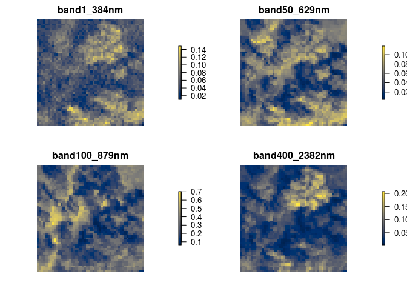
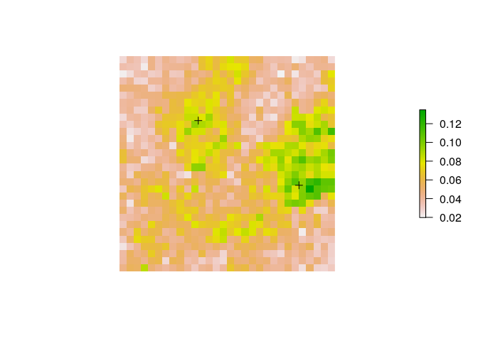
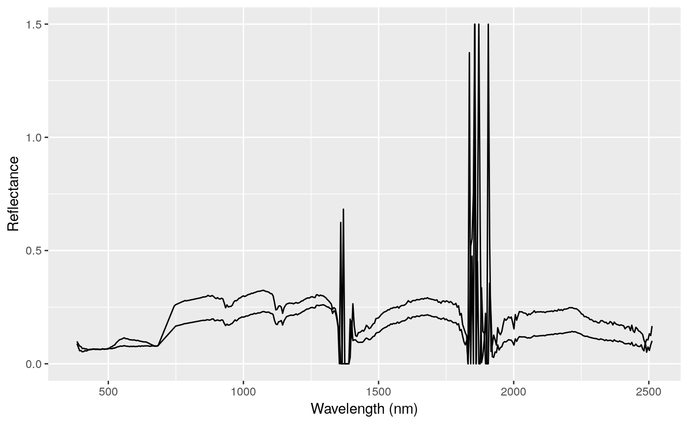

<!-- README.md is generated from README.Rmd. Please edit that file -->

# neonhs

[](https://www.repostatus.org/#active)
[](https://github.com/earthlab/neonhs/actions)
[](https://ci.appveyor.com/project/earthlab/neonhs)
[](https://codecov.io/github/earthlab/neonhs?branch=master)
[](https://zenodo.org/badge/latestdoi/168047013)

The goal of neonhs is to make data from the National Ecological
Observatory Network (NEON) Airborne Observation Platform (AOP)
hyperspectral instrument easier to use. The NEON AOP collects
hyperspectral imagery via its at a 1 meter spatial resolution for 426
different wavelengths.

## Installation

You can install the development version of neonhs via:

``` r
#install.packages('devtools')
devtools::install_github('earthlab/neonhs')
```

## Examples

### Create raster objects from hyperspectral images

This is a basic example which shows you how to read some bands from L3
hyperspectral reflectance data as a multi-layer raster:

``` r
library(neonhs)
library(raster)
library(viridis)
library(sp)
library(tidyverse)

path_to_file <- system.file('extdata', 'ex.h5', package = 'neonhs')
r <- hs_read(path_to_file, bands = c(1, 50, 100, 400))
r
#> class      : RasterBrick 
#> dimensions : 30, 30, 900, 4  (nrow, ncol, ncell, nlayers)
#> resolution : 1, 1  (x, y)
#> extent     : 257000, 257030, 4111970, 4112000  (xmin, xmax, ymin, ymax)
#> crs        : +proj=utm +zone=11 +datum=WGS84 +units=m +no_defs 
#> source     : memory
#> names      : band1_384nm, band50_629nm, band100_879nm, band400_2382nm 
#> min values :      0.0198,       0.0073,        0.0620,         0.0051 
#> max values :      0.1348,       0.1113,        0.6743,         0.2072
```

``` r
plot(r, col = cividis(100), axes = FALSE, box = FALSE)
```



### Extract spectra at spatial point locations

If you need to extract spectra at spatial points, there is a
`hs_extract_pts` function that extracts values from bands efficiently,
without needing to first create a raster object.

For example, we may want to extract spectra for every band at the
following two points, defined in a `SpatialPointsDataFrame`. Note also
that we can use the `hs_proj4string` function to get the proj4string
representation of the coordinate reference system used in the
hyperspectral image.

``` r
pts <- SpatialPointsDataFrame(coords = data.frame(x = c(257025, 257011),
                                                  y = c(4111982, 4111991)), 
                              data = data.frame(id = 1:2),
                              proj4string = CRS(hs_proj4string(path_to_file)))
plot(r[[1]], axes = FALSE, box = FALSE)
plot(pts, add = TRUE)
```



To do this efficiently, you can use `hs_extract_pts`:

``` r
vals <- hs_extract_pts(path_to_file, pts = pts, bands = 1:426)
vals
#> class       : SpatialPointsDataFrame 
#> features    : 2 
#> extent      : 257011, 257025, 4111982, 4111991  (xmin, xmax, ymin, ymax)
#> crs         : +proj=utm +zone=11 +datum=WGS84 +units=m +no_defs 
#> variables   : 429
#> names       : id, band1_384nm, band2_389nm, band3_394nm, band4_399nm, band5_404nm, band6_409nm, band7_414nm, band8_419nm, band9_424nm, band10_429nm, band11_434nm, band12_439nm, band13_444nm, band14_449nm, ... 
#> min values  :  1,      0.0889,      0.0734,      0.0574,      0.0579,      0.0528,       0.054,       0.058,      0.0563,      0.0595,        0.062,       0.0618,       0.0637,       0.0642,       0.0637, ... 
#> max values  :  2,      0.0987,      0.0879,      0.0778,      0.0759,      0.0669,      0.0681,      0.0656,      0.0659,       0.062,        0.063,        0.064,       0.0639,       0.0657,       0.0653, ...
```

Now we have columns with band indices and wavelengths, which we can use
to plot spectra, e.g.,

``` r
vals %>%
  as_tibble() %>%
  select(id, starts_with('band')) %>%
  gather(band, reflectance, -id) %>%
  separate(band, c('index', 'wavelength')) %>%
  mutate(wavelength = parse_number(wavelength)) %>%
  ggplot(aes(wavelength, reflectance, group = id)) + 
  geom_line() + 
  xlab('Wavelength (nm)') + 
  ylab('Reflectance')
```


